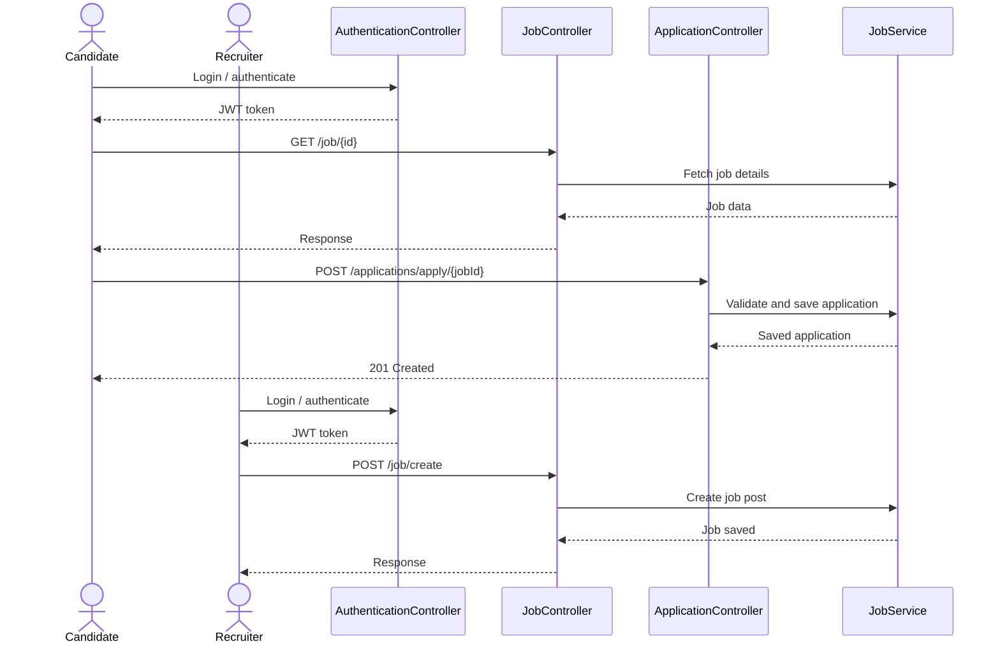
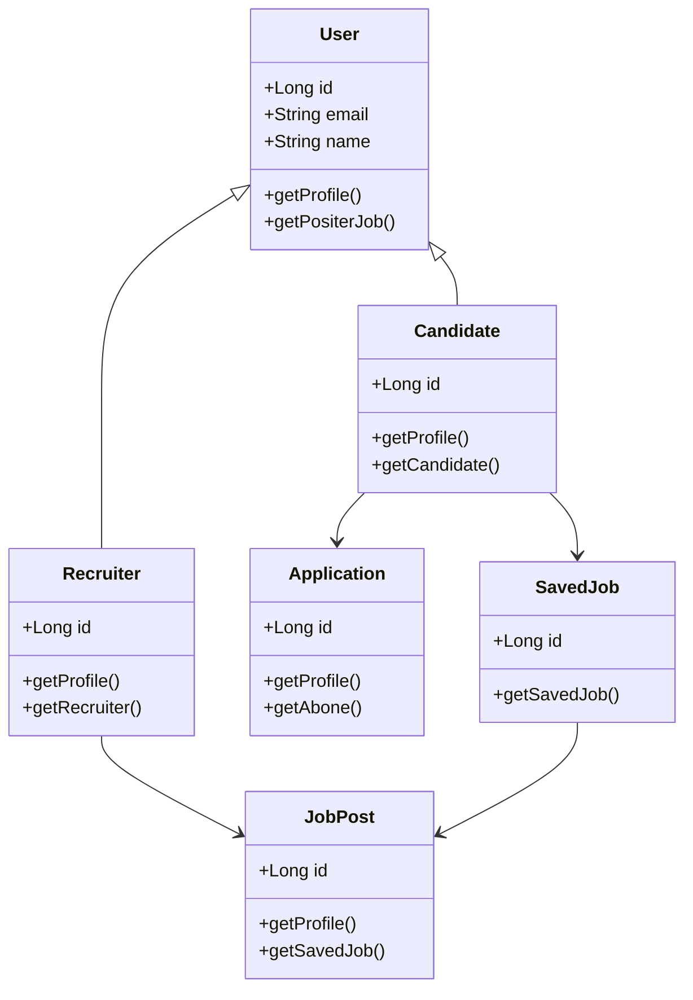
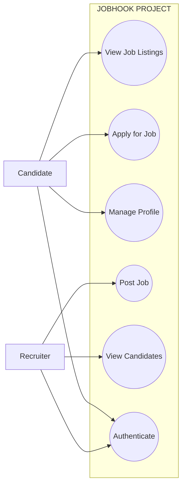

# JobHook Sequence Diagram

This sequence diagram shows the interaction flow of the JobHook application between the user, frontend, controllers, and backend services.

## Description

The diagram represents how a Candidate or Recruiter interacts with the system. The frontend sends requests to the backend, the authentication layer validates the user, and the controller and service layers process the action before returning a response.

## Main Flow

1. The user opens the JobHook application.
2. The frontend sends the request to the backend.
3. The authentication controller verifies the JWT token.
4. The request is routed to the appropriate controller.
5. The controller calls the service layer for business logic.
6. The service layer processes the request and interacts with the database.
7. The backend returns the result to the frontend.
8. The UI updates based on the response.

## Candidate Flow

- View job details.
- Apply for a job.
- Save a job for later.
- Receive the response from the backend after each action.

## Recruiter Flow

- Create a job post.
- Manage job details.
- Review applicant-related actions.
- Receive the response from the backend after each action.

## How To View It

1. Open this file in VS Code: `job-portal-backend/README.md`.
2. Press `Ctrl + Shift + V` to open Markdown Preview.
3. If Mermaid is not rendering, install the extension **Markdown Preview Mermaid Support**.
4. Refresh the preview after installing the extension.

## Short Caption for Report

This sequence diagram illustrates the request flow in JobHook, showing how Candidate and Recruiter actions pass through the frontend, authentication layer, controllers, and service layer before a response is returned.

## Class Diagram

## Short Caption for Class Diagram

This class diagram shows the inheritance relationship between User, Candidate, and Recruiter, along with the associations between Candidate, Application, SavedJob, Recruiter, and JobPost.

## Use Case Diagram

## Short Caption for Use Case Diagram

This use case diagram shows the main interactions in JobHook. The Candidate can view job listings, apply for jobs, and manage a profile, while the Recruiter can post jobs, view candidates, and authenticate to access the system.
